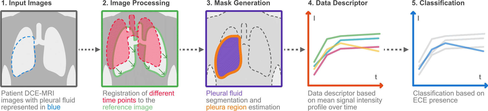
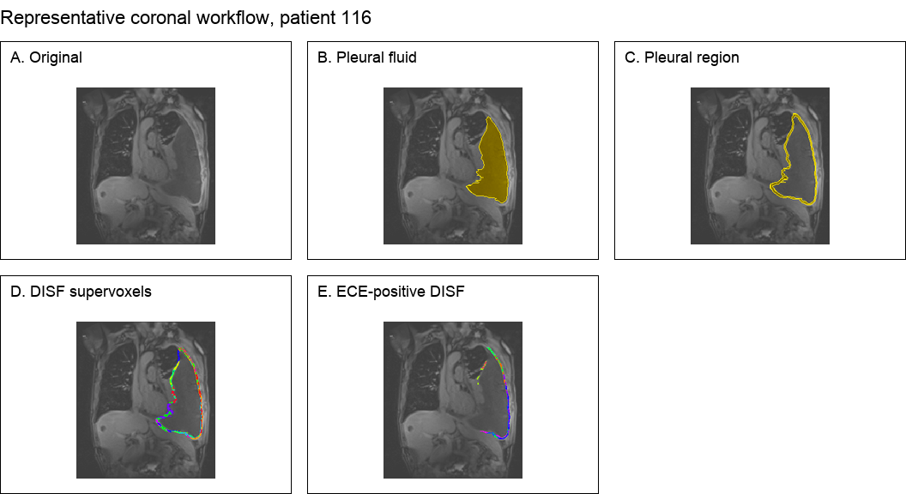
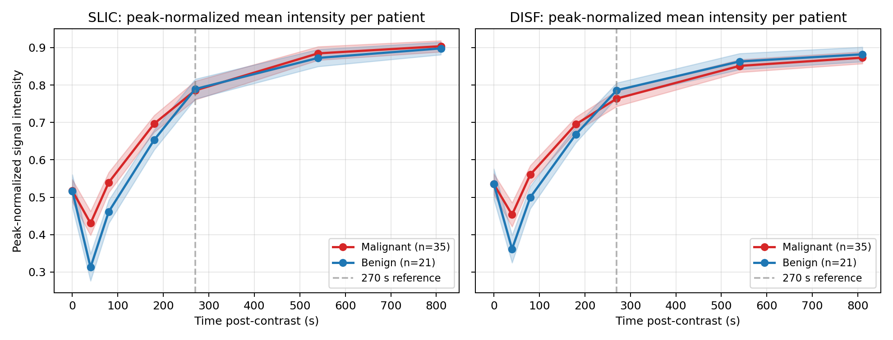

# Meso-Regions

Automated 4D segmentation of **Early Contrast Enhancement (ECE)** biomarker regions in pleural
DCE-MRI, for pleural mesothelioma research.

Meso-Regions takes a 4D (3D + time) dynamic contrast-enhanced MRI series and produces
patient-specific ECE-positive segmentation masks and a patient-level malignancy call, without
manual ROI placement:

1. **Motion correction** — SyN diffeomorphic registration (ANTs) of all time points to the
   270-s post-contrast reference.
2. **Pleural region extraction** — semi-automatic pleural-effusion segmentation (image foresting
   transform) followed by morphological rim isolation around the fluid.
3. **4D supervoxels ("superspels")** — SLIC or DISF partitions of the pleural region, propagated
   across all time points.
4. **Signal-intensity descriptors** — background-corrected mean-intensity curve per superspel.
5. **ECE rule classification** — a superspel is ECE-positive if its curve peaks at ≤270 s, has its
   minimum pre-contrast, and rises monotonically to the peak then falls; a patient is called
   malignant if any superspel is ECE-positive.


*Pipeline overview — input DCE-MRI, registration, pleural-region mask generation, per-superspel
intensity descriptors, and ECE-rule classification. Figure from Theodoro et al., IEEE ISBI 2026
(© 2026 IEEE).*


*Representative coronal workflow at 270 s post-contrast: native image, segmented pleural
effusion, derived pleural-region mask, DISF supervoxels, and ECE-positive output (panels D–E
from Theodoro et al., IEEE ISBI 2026, © 2026 IEEE).*


*Patient-mean peak-normalised signal-intensity curves stratified by histology (shaded bands:
SEM), for SLIC and DISF partitions.*

> ⚠️ **Research use only.** This software is not a medical device and must not be used for
> clinical diagnosis or treatment decisions.

## Installation

```bash
git clone https://github.com/tayllatheodoro/meso-regions.git
cd meso-regions
pip install -e .
```

DISF supervoxels additionally require the
[libIFT / DISF reference implementation](https://github.com/LIDS-UNICAMP) (LIDS-UNICAMP);
SLIC works out of the box via scikit-image.

## Usage

The pipeline is driven by a YAML config through the `meso-regions` CLI:

```bash
meso-regions stages                      # list available pipeline stages + options
meso-regions example-config > config.yaml
# edit config.yaml: paths, patient ids, pipeline stages
meso-regions run -c config.yaml --dry-run   # validate without executing
meso-regions run -c config.yaml
```

A pipeline is an ordered list of stages (`resample`, `ants_reg`, `dilate`, `slic`, `disf`,
`full_ece`, …); each stage's options map to the functions in `meso_regions/run/config.py`.
Inputs are NIfTI volumes organised per patient and time point. Note: the `disf` stage's
`ift_path` must point to your local libIFT build. The original research scripts remain
under `meso_regions/run/` for reference.

## Data

The imaging dataset used in the papers is governed by the PREDICT-Meso network. Researchers can
request access at: https://www.predictmeso.com/research-tissue-bank/#rtbform. The curated 4D
pleural-effusion ground-truth masks are released alongside the journal paper.

## Citation

If you use this software, please cite the ISBI 2026 paper:

> Theodoro TM, Silva IF, Tsim S, Blyth K, Falcão AX. *Meso-Regions: 4D segmentation of early
> contrast enhancement biomarkers for pleural mesothelioma diagnosis.* Proc IEEE 23rd
> International Symposium on Biomedical Imaging (ISBI), 2026.

```bibtex
@inproceedings{theodoro2026mesoregions,
  author    = {Theodoro, Taylla M. and Silva, Ilan F. and Tsim, Selina and
               Blyth, Kevin and Falc{\~a}o, Alexandre X.},
  title     = {Meso-Regions: {4D} Segmentation of Early Contrast Enhancement
               Biomarkers for Pleural Mesothelioma Diagnosis},
  booktitle = {Proc. IEEE 23rd International Symposium on Biomedical Imaging (ISBI)},
  year      = {2026},
}
```

### Related publications

The method was first presented at the 16th International Mesothelioma Interest Group (iMig)
conference and covered in its imaging review:

> Armato SG III, Katz SI, Frauenfelder T, Jayasekera G, Catino A, Blyth KG, Theodoro T,
> Rousset P, Nackaerts K, Opitz I. *Imaging in pleural mesothelioma: a review of the 16th
> international conference of the International Mesothelioma Interest Group.* Lung Cancer
> 2024;193:107832.

The ECE biomarker was originally described in:

> Tsim S, Humphreys CA, Cowell GW, Stobo DB, Noble C, Woodward R, Kelly CA, Alexander L,
> Foster JE, Dick C, Blyth KG. *Early contrast enhancement: a novel magnetic resonance imaging
> biomarker of pleural malignancy.* Lung Cancer 2018;118:48–56.

Extended methodology in the master's dissertation:

> Theodoro TM. *Towards Automatic Detection of Pleural Mesothelioma Biomarker in 4D Dynamic
> MR Imaging.* MSc dissertation, Institute of Computing, University of Campinas (UNICAMP).
> https://github.com/tayllatheodoro/meso-master-thesis

## License

GPL-3.0 — see [LICENSE](LICENSE).
